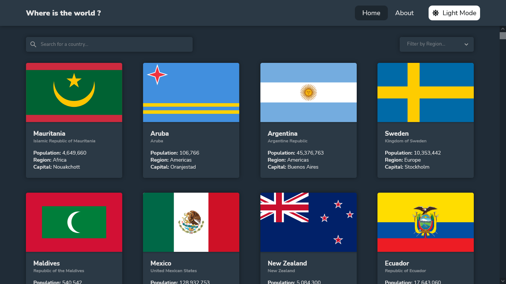
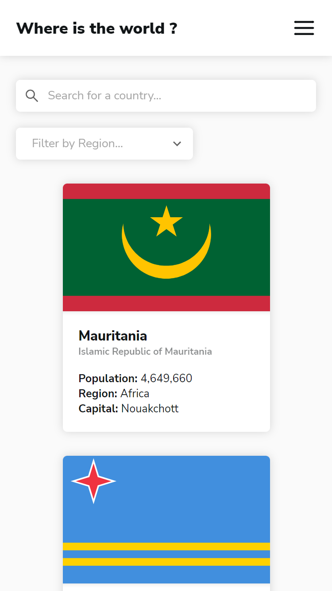

# Frontend Mentor - REST Countries API with color theme switcher solution

This is a solution to the [REST Countries API with color theme switcher challenge](https://www.frontendmentor.io/challenges/rest-countries-api-with-color-theme-switcher-5cacc469fec04111f7b848ca) on [Frontend Mentor website](https://www.frontendmentor.io/home). Frontend Mentor challenges help you improve your coding skills by building realistic projects.

## Table of contents

- [Frontend Mentor - REST Countries API with color theme switcher solution](#frontend-mentor---rest-countries-api-with-color-theme-switcher-solution)
  - [Table of contents](#table-of-contents)
  - [Overview](#overview)
    - [The challenge](#the-challenge)
    - [Screenshots](#screenshots)
      - [Desktop view](#desktop-view)
      - [Smartphone view](#smartphone-view)
    - [Links](#links)
  - [My process](#my-process)
    - [Built with](#built-with)
    - [What I learned](#what-i-learned)
  - [Author](#author)

## Overview

### The challenge

The challenge is to integrate the [REST Countries API](https://restcountries.com) to extract country data and display it as in the designs.

Users should be able to:

- See all countries from the API on the homepage
- Search for a country using an `input` field
- Filter countries by region
- Click on a country to see more detailed information on a separate page
- Click through to the border countries on the detail page
- Toggle the color scheme between light and dark mode

### Screenshots

#### Desktop view

#### Smartphone view

### Links

- Solution URL: [Github repo](https://github.com/abdelkadir-bouziane/rest-countries-api)
- Live Site URL: [Live site](https://abdelkadir-bouziane.github.io/rest-countries-api/)

## My process

### Built with

- [React](https://reactjs.org/) - JS library

### What I learned

- I learned how to use the useContext hook with reducers to manage the global state of an application.
- I learned how to use react's styled components to create multiple themes for an application (I just used a global style in this project).
- I discovered the react useRef hook.
- I practiced using React Routers.
- I discovered some cool features in CSS such as: min and max functions and 3D transformations of elements.
- I practiced using CSS grids.

## Author

- Frontend Mentor - [@abdelkadir-bouziane](https://www.frontendmentor.io/profile/abdelkadir-bouziane)
- Github - [abdelkadir-bouziane](https://github.com/abdelkadir-bouziane)
